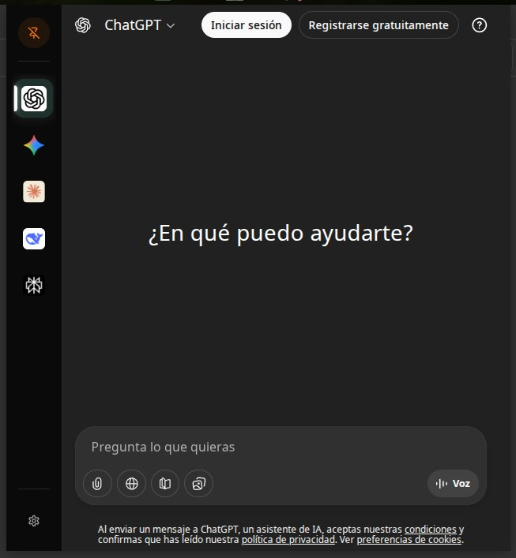
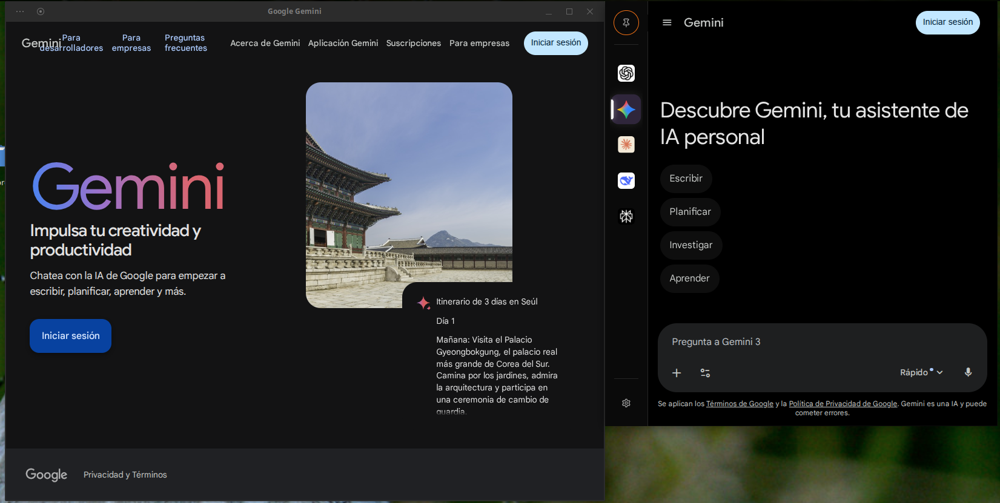
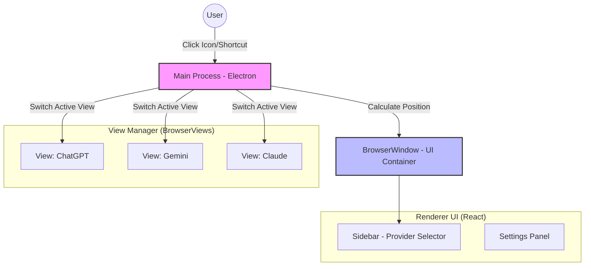

# 🧠 NeuralDeck


> **Your invisible AI command center.**
>
> Access ChatGPT, Gemini, Claude, DeepSeek, and local models from a single floating interface in your system tray, designed to keep your workflow uninterrupted.

---

## 📖 About the Project

**NeuralDeck** is not just another browser; it's a utility layer for your operating system. It solves the problem of having 50 tabs open trying to find where you left your AI conversation.

It works as a **"Ghost Window"**: always there, loaded in memory, but only appears when you need it and disappears when you return to your code or document.

### ✨ Key Features

- **⚡ Instant Access:** Lives in the System Tray. One click (or `Ctrl+Space`) and it appears; lose focus and it disappears.
- **🌐 Multi-AI Hub:**
  - OpenAI ChatGPT
  - Google Gemini
  - Anthropic Claude
  - DeepSeek
  - Perplexity
  - Custom providers
- **🧠 Chromium Engine:** Built on Electron to ensure 1:1 compatibility with modern web apps and robust authentication management (Google Auth, etc).
- **🛡️ Stealth Mode:** Privacy options, cache clearing on close, and tracker blocking.
- **💻 True Cross-Platform:** Works on Windows 10/11, macOS (Intel/Silicon), and Linux (X11/Wayland\*).

### 📸 Screenshots




---

## 🏗️ Technical Architecture

NeuralDeck uses a hybrid architecture to minimize resource consumption while maintaining web compatibility.



- **Main Process:** Manages lifecycle, tray icon, and window positioning.
- **UI Renderer:** A lightweight React application that renders the sidebar and controls.
- **BrowserViews:** Each AI loads in an independent hardware-accelerated view, isolated from the main UI process.

---

## 🛠️ Technology Stack

| Area         | Technology           | Purpose                                             |
| :----------- | :------------------- | :-------------------------------------------------- |
| **Core**     | **Electron**         | Stable cross-platform runtime.                      |
| **Frontend** | **React + Vite**     | Fast and modular user interface.                    |
| **Styling**  | **TailwindCSS**      | Modern and responsive design.                       |
| **Language** | **TypeScript**       | Static typing for long-term robustness.             |
| **State**    | **Zustand**          | Minimalist global state management.                 |
| **Build**    | **Electron-Builder** | Packaging and distribution (.exe, .dmg, .AppImage). |

---

## 🚀 Roadmap

- [x] **v0.1.0 (MVP):**
  - Base Electron + React structure.
  - System Tray support (Windows/Linux/Mac).
  - Show/Hide/Blur window logic.
  - Basic ChatGPT and Gemini integration via `BrowserView`.
- [x] **v0.2.0 (UI & Config):**
  - Session persistence (cookies).
  - Collapsible sidebar.
  - Configurable global keyboard shortcuts.
- [x] **v0.3.0 (Local AI):**
  - Ollama integration with model selection.
  - Markdown rendering for AI responses.
  - i18n system with English and Spanish translations.
  - Modular backend architecture.
- [x] **v1.0.0 (Stable Release):**
  - Migrated to WebContentsView (Electron 35+).
  - Code signing configuration.
  - Auto-updates with electron-updater.
  - First-run onboarding experience.
  - Settings UI with search functionality.
  - Drag-and-drop provider reordering.
  - View preloading and memory management.
  - Performance telemetry endpoints.
  - E2E and integration test infrastructure.

---

## 🔧 Installation and Development

Follow these steps to set up the local development environment.

### Prerequisites

- Node.js (v18 or higher)
- npm or yarn

### Steps

1.  **Clone the repository:**

    ```bash
    git clone https://github.com/murapadev/NeuralDeck.git
    cd NeuralDeck
    ```

2.  **Install dependencies:**

    ```bash
    npm install
    ```

3.  **Start in development mode:**

    ```bash
    npm run dev
    ```

    _This will start the Vite server and launch the Electron window._

4.  **Build binary:**

    ```bash
    npm run build:win   # For Windows
    npm run build:linux # For Linux
    npm run build:mac   # For macOS
    ```

---

## 🚀 Release Process

NeuralDeck uses automated CI/CD for testing and releases:

### Automated Testing

Every push and pull request triggers automated tests:

- Linting and code style checks
- TypeScript type checking
- Unit and integration tests
- Multi-platform build verification

### Creating a Release

To create a new release:

1. **Update version** in `package.json`:

   ```bash
   npm version patch  # or minor, major
   ```

2. **Push the tag**:

   ```bash
   git push origin main --tags
   ```

3. **GitHub Actions will automatically**:
   - Run all tests
   - Build binaries for Windows, macOS, and Linux
   - Create a GitHub Release
   - Upload all artifacts

### Download Releases

Download the latest release from the [Releases page](https://github.com/murapadev/NeuralDeck/releases):

- **Windows**: `.exe` installer or portable version
- **Linux**: `.AppImage` (universal) or `.deb` (Debian/Ubuntu)
- **macOS**: `.dmg` installer

---

## 🤝 Contributing

Pull requests are welcome. For major changes, please open an issue first to discuss what you would like to change.

1.  Fork the project
2.  Create your feature branch (`git checkout -b feature/AmazingFeature`)
3.  Commit your changes (`git commit -m 'Add some AmazingFeature'`)
4.  Push to the branch (`git push origin feature/AmazingFeature`)
5.  Open a Pull Request

---

## 📄 License

Distributed under the MIT License. See `LICENSE` for more information.
