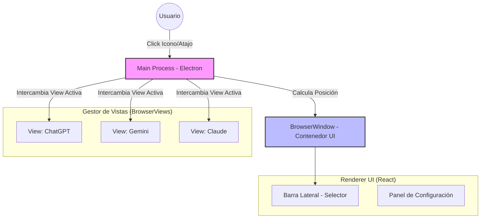

# 🧠 NeuralDeck

   

> **Tu centro de mando de IA invisible.**
>
> Accede a ChatGPT, Gemini, Claude, DeepSeek y modelos locales desde una única interfaz flotante en tu bandeja del sistema, diseñada para no interrumpir tu flujo.

---

## 📖 Sobre el Proyecto

**NeuralDeck** no es solo otro navegador; es una capa de utilidad ("utility layer") para tu sistema operativo. Resuelve el problema de tener 50 pestañas abiertas buscando dónde dejaste la conversación con la IA.

Funciona como una **"Ventana Fantasma"**: siempre está ahí, cargada en memoria, pero solo aparece cuando la necesitas y desaparece cuando vuelves a tu código o documento.

### ✨ Características Principales

* **⚡ Acceso Instantáneo:** Vive en el System Tray. Un clic (o `Ctrl+Space`) y aparece; pierde el foco y desaparece.
* **🌐 Hub Multi-IA:**
    * OpenAI ChatGPT
    * Google Gemini
    * Anthropic Claude
    * DeepSeek
    * Perplexity
* **🧠 Motor Chromium:** Construido sobre Electron para garantizar compatibilidad 1:1 con las webs modernas y gestión de autenticación robusta (Google Auth, etc).
* **🛡️ Modo Stealth:** Opciones de privacidad, borrado de caché al cerrar y bloqueo de rastreadores.
* **💻 Cross-Platform Real:** Funciona en Windows 10/11, macOS (Intel/Silicon) y Linux (X11/Wayland*).

---

## 🏗️ Arquitectura Técnica

NeuralDeck utiliza una arquitectura híbrida para minimizar el consumo de recursos mientras mantiene la compatibilidad web.



  * **Main Process:** Gestiona el ciclo de vida, el icono del tray y la posición de la ventana.
  * **UI Renderer:** Una aplicación React ligera que pinta la barra lateral y los controles.
  * **BrowserViews:** Cada IA se carga en una vista independiente acelerada por hardware, aislada del proceso principal UI.

-----

## 🛠️ Stack Tecnológico

| Área | Tecnología | Propósito |
| :--- | :--- | :--- |
| **Core** | **Electron** | Runtime multiplataforma estable. |
| **Frontend** | **React + Vite** | Interfaz de usuario rápida y modular. |
| **Estilos** | **TailwindCSS** | Diseño moderno y responsive. |
| **Lenguaje** | **TypeScript** | Tipado estático para robustez a largo plazo. |
| **Estado** | **Zustand** | Gestión de estado global minimalista. |
| **Build** | **Electron-Builder** | Empaquetado y distribución (.exe, .dmg, .AppImage). |

-----

## 🚀 Roadmap

  - [ ] **v0.1.0 (MVP):**
      - Estructura base Electron + React.
      - Soporte para System Tray (Windows/Linux/Mac).
      - Lógica de ocultar/mostrar ventana (Show/Hide/Blur).
      - Integración básica de ChatGPT y Gemini via `BrowserView`.
  - [ ] **v0.2.0 (UI & Config):**
      - Persistencia de sesión (cookies).
      - Barra lateral colapsable.
      - Atajos de teclado globales configurables.
  - [ ] **v0.3.0 (Local AI):**
      - Integración con Ollama (interfaz web local).
  - [ ] **v1.0.0 (Release):**
      - Firma de código.
      - Actualizaciones automáticas.

-----

## 🔧 Instalación y Desarrollo

Sigue estos pasos para levantar el entorno de desarrollo local.

### Prerrequisitos

  * Node.js (v18 o superior)
  * npm o yarn

### Pasos

1.  **Clonar el repositorio:**

    ```bash
    git clone [https://github.com/tu-usuario/NeuralDeck.git](https://github.com/tu-usuario/NeuralDeck.git)
    cd NeuralDeck
    ```

2.  **Instalar dependencias:**

    ```bash
    npm install
    ```

3.  **Iniciar en modo desarrollo:**

    ```bash
    npm run dev
    ```

    *Esto iniciará el servidor Vite y lanzará la ventana de Electron.*

4.  **Construir binario:**

    ```bash
    npm run build:win   # Para Windows
    npm run build:linux # Para Linux
    npm run build:mac   # Para macOS
    ```

-----

## 🤝 Contribuyendo

Las Pull Requests son bienvenidas. Para cambios importantes, por favor abre primero un issue para discutir lo que te gustaría cambiar.

1.  Haz un Fork del proyecto
2.  Crea tu rama de feature (`git checkout -b feature/AmazingFeature`)
3.  Haz Commit de tus cambios (`git commit -m 'Add some AmazingFeature'`)
4.  Haz Push a la rama (`git push origin feature/AmazingFeature`)
5.  Abre un Pull Request

-----

## 📄 Licencia

Distribuido bajo la licencia MIT. Ver `LICENSE` para más información.


