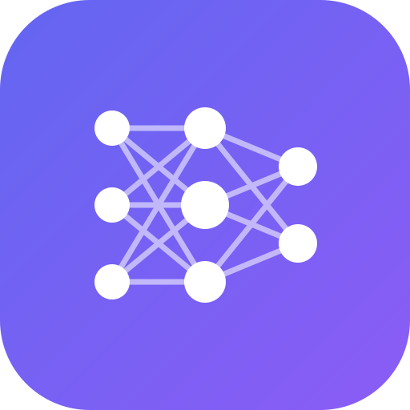

<p align="center">
  
</p>

<h1 align="center">NeuralDeck</h1>

<p align="center">
  <a href="https://opensource.org/licenses/MIT"></a>
  
  
  
  
</p>

> Tu centro de mando de IA invisible. Accede a ChatGPT, Gemini, Claude, DeepSeek, Perplexity y modelos locales Ollama desde una interfaz flotante, siempre a mano con un atajo de teclado.

---

## Características

- **Acceso instantáneo** — vive en la bandeja del sistema; `Ctrl+Shift+Space` la muestra u oculta
- **Multi-AI Hub** — ChatGPT, Gemini, Claude, DeepSeek, Perplexity embebidos en WebView nativo
- **Ollama local** — chat con streaming, historial persistente, selector de modelos en vivo
- **Providers personalizados** — añade cualquier URL como proveedor en Settings → Providers
- **Atajos por proveedor** — `Ctrl+Shift+1..5` para saltar directamente a cada IA
- **Stealth mode** — `HideOnBlur` oculta la ventana al perder el foco; siempre encima opcional
- **Temas y acento** — Dark/Light/System + 8 colores de acento con preview en vivo
- **Zero-bloat** — .NET 10 nativo, sin Electron, ~60 MB autocontenido

## Instalación (desarrollo)

```bash
git clone https://github.com/murapadev/NeuralDeck.git
cd NeuralDeck

# Linux: necesita WebKitGTK 4.1
sudo apt install libwebkit2gtk-4.1-dev   # Debian/Ubuntu
sudo pacman -S webkit2gtk-4.1            # Arch

dotnet restore
dotnet run
```

## Build

```bash
# Debug local
dotnet build

# Release autocontenido (sin .NET instalado en el sistema destino)
dotnet publish -c Release -r linux-x64 --self-contained true -p:PublishSingleFile=true
dotnet publish -c Release -r win-x64   --self-contained true -p:PublishSingleFile=true
dotnet publish -c Release -r osx-arm64 --self-contained true -p:PublishSingleFile=true
```

## Atajos de teclado

| Acción | Atajo |
|--------|-------|
| Mostrar / ocultar | `Ctrl+Shift+Space` |
| Abrir ajustes | `Ctrl+,` |
| Provider 1..5 | `Ctrl+Shift+1..5` |
| Salir | `Ctrl+Q` |
| Cerrar ajustes | `Esc` o `Ctrl+W` |

## Configuración

La configuración se guarda en `~/.config/NeuralDeck/config.json` (Linux/macOS) o `%APPDATA%\NeuralDeck\config.json` (Windows).

## Stack

- [.NET 10](https://dotnet.microsoft.com/) + [Avalonia UI 11.2](https://avaloniaui.net/)
- [Avalonia.Controls.WebView 11.4](https://github.com/AvaloniaUI/Avalonia.WebView) (WebKitGTK nativo)
- [CommunityToolkit.Mvvm](https://github.com/CommunityToolkit/dotnet) — MVVM source generators
- [SharpHook](https://github.com/TolikPylypchuk/SharpHook) — atajos globales

## Contribución

Las contribuciones son bienvenidas. Abre un issue o pull request.

## Licencia

MIT — ver [LICENSE](LICENSE).

---

*Hecho con ❤️ por [murapadev](https://github.com/murapadev)*
